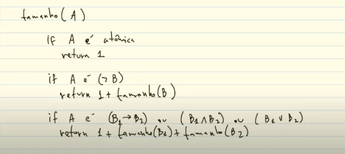

# LISTA 1 -  FÓRMULAS DA LÓGICA PROPOSICIONAL
----
## Questão 1
1- Defina um pseudocódigo recursivo para a função number_of_connectives(A) que retorna a quantidade de conectivos da fórmula de entrada A. Por exemplo, number_of_connectives(((¬p) → (¬q))) = 3. Em seguida, você deve usar o código disponível em https://github.com/thiagoalvesifce/logicomp e escrever um código para a função number_of_connectives(formula).
- Definindo em pseudocódigo:

- Código para função number_of_connectives(formula)
`````python
def formula_size(formula):
    if isinstance(formula, Atom):
        return 1
    elif isinstance(formula, Not):
        return 1 + formula_size(formula.inner)
    elif isinstance(formula, (And, Or, Implies)):
        return 1 + formula_size(formula.left) + formula_size(formula.right)

print(formula_size(formula))
``````
----
## Questão 2
Conforme a definição de fórmula da lógica proposicional, os conectivos binários devem ser escritos na forma infixa, ou seja, devem ser escritos entre duas fórmulas. Essa definição poderia ser modificada possibilitando escrever os conectivos na notação polonesa, conforme indicado pelas correspondências a seguir:

- A fórmula A atômica corresponde à fórmula A na notação polonesa,
- (¬A) corresponde a ¬A,
- (A ∧ B) corresponde a ∧AB,
- (A ∨ B) corresponde a ∨AB,
- (A → B) corresponde a →AB.

Escreva as fórmulas a seguir utilizando a notação polonesa:

(a) ¬(p → ¬q)
- Resposta: ¬→p¬q

(b) ((¬¬p ∨ q) → (p → q))
- Resposta: →∨¬¬pq→pq
----
## Questão 3
Defina recursivamente um pseudocódigo para a função `atoms(A)` que retorna o  
conjunto de todas as fórmulas atômicas que ocorrem em A. Por exemplo,  
`atoms(p ∧ ¬(p → ¬q) ∨ ¬q) = {p, q}`.  

Em seguida, você deve usar o repositório disponível em  
https://github.com/thiagoalvesifce/logicomp  
e escrever um código para definir a função `atoms(formula)`. Por exemplo,  

```python
atoms(Or(Not(And(Atom('p'), Atom('choveu_ontem'))), Atom('p')))
````
deve retornar um conjunto com as atômicas `Atom('p')` e `Atom('choveu_ontem')`.
- Resposta: 
````python
def formula_atoms(formula):
    if isinstance(formula, Atom):
        return {formula.name} 
    elif isinstance(formula, Not):
        return formula_atoms(formula.inner)
    elif isinstance(formula, (And, Or, Implies)):
        return formula_atoms(formula.left) | formula_atoms(formula.right)


print("Questão 2 - Atoms da Fórmula:", formula_atoms(formula))
````
----
## Questão 4
Uma fórmula está na forma normal da negação (NNF - do inglês: negation normal  
form) se a negação só é aplicada diretamente nas atômicas e os outros únicos  
conectivos permitidos são a conjunção e a disjunção. Por exemplo,  
`((p ∧ (¬(q ∧ r))) ∧ (¬r)) ∨ s` não está na NNF e  
`((p ∧ ((¬q) ∧ r)) ∧ (¬r)) ∨ s` está na NNF.  

Defina um pseudocódigo para a função `is_negation_normal_form(A)` para verificar  
se A está na NNF. Em seguida, você deve usar o repositório disponível em  
https://github.com/thiagoalvesifce/logicomp  
e escrever um código para a função `is_negation_normal_form(formula)`.
- Resposta:
````python
def is_negation_formal_formula(formula):
    if isinstance(formula, Atom):
        return True
    elif isinstance(formula, Not):
        return isinstance(formula.inner, Atom)
    elif isinstance(formula, (And, Or, Implies)):
        return is_negation_formal_formula(formula.left) and is_negation_formal_formula(formula.right)
    else:
        return False


print("Questao 3 - Eh uma Formula Negativa? ", is_negation_formal_formula(formula))
````
----
## Questão 5
