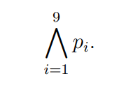
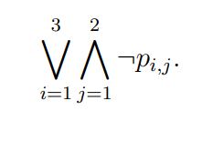
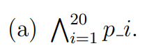
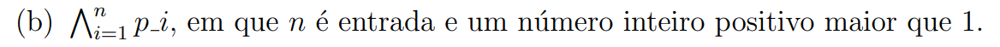
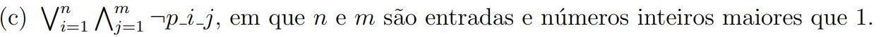
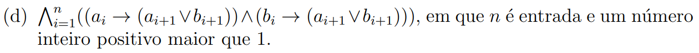
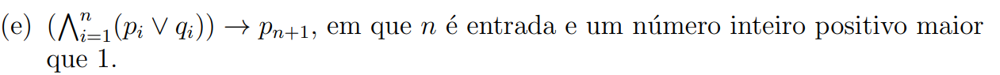
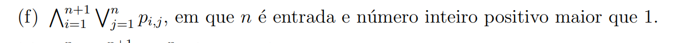
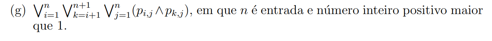

OBS: As imagens que estão no repositório podem ser ignoradas. Elas só servem para fazer referência ao Markdown. Costumo utilizar o Notion que já cuida dessa parte, mas para botar no Github ficaria mais fácil fazer direto pelo Markdown mesmo.
----
# LISTA 1 -  FÓRMULAS DA LÓGICA PROPOSICIONAL
----
## Questão 1
1- Defina um pseudocódigo recursivo para a função number_of_connectives(A) que retorna a quantidade de conectivos da fórmula de entrada A. Por exemplo, number_of_connectives(((¬p) → (¬q))) = 3. Em seguida, você deve usar o código disponível em https://github.com/thiagoalvesifce/logicomp e escrever um código para a função number_of_connectives(formula).
- Definindo em pseudocódigo:

- Código para função number_of_connectives(formula)
`````python
def formula_size(formula):
    if isinstance(formula, Atom):
        return 1
    elif isinstance(formula, Not):
        return 1 + formula_size(formula.inner)
    elif isinstance(formula, (And, Or, Implies)):
        return 1 + formula_size(formula.left) + formula_size(formula.right)

print(formula_size(formula))
``````
----
## Questão 2
Conforme a definição de fórmula da lógica proposicional, os conectivos binários devem ser escritos na forma infixa, ou seja, devem ser escritos entre duas fórmulas. Essa definição poderia ser modificada possibilitando escrever os conectivos na notação polonesa, conforme indicado pelas correspondências a seguir:

- A fórmula A atômica corresponde à fórmula A na notação polonesa,
- (¬A) corresponde a ¬A,
- (A ∧ B) corresponde a ∧AB,
- (A ∨ B) corresponde a ∨AB,
- (A → B) corresponde a →AB.

Escreva as fórmulas a seguir utilizando a notação polonesa:

(a) ¬(p → ¬q)
- Resposta: ¬→p¬q

(b) ((¬¬p ∨ q) → (p → q))
- Resposta: →∨¬¬pq→pq
----
## Questão 3
Defina recursivamente um pseudocódigo para a função `atoms(A)` que retorna o  
conjunto de todas as fórmulas atômicas que ocorrem em A. Por exemplo,  
`atoms(p ∧ ¬(p → ¬q) ∨ ¬q) = {p, q}`.  

Em seguida, você deve usar o repositório disponível em  
https://github.com/thiagoalvesifce/logicomp  
e escrever um código para definir a função `atoms(formula)`. Por exemplo,  

```python
atoms(Or(Not(And(Atom('p'), Atom('choveu_ontem'))), Atom('p')))
````
deve retornar um conjunto com as atômicas `Atom('p')` e `Atom('choveu_ontem')`.
- Resposta: 
````python
def formula_atoms(formula):
    if isinstance(formula, Atom):
        return {formula.name} 
    elif isinstance(formula, Not):
        return formula_atoms(formula.inner)
    elif isinstance(formula, (And, Or, Implies)):
        return formula_atoms(formula.left) | formula_atoms(formula.right)


print("Questão 2 - Atoms da Fórmula:", formula_atoms(formula))
````
----
## Questão 4
Uma fórmula está na forma normal da negação (NNF - do inglês: negation normal  
form) se a negação só é aplicada diretamente nas atômicas e os outros únicos  
conectivos permitidos são a conjunção e a disjunção. Por exemplo,  
`((p ∧ (¬(q ∧ r))) ∧ (¬r)) ∨ s` não está na NNF e  
`((p ∧ ((¬q) ∧ r)) ∧ (¬r)) ∨ s` está na NNF.  

Defina um pseudocódigo para a função `is_negation_normal_form(A)` para verificar  
se A está na NNF. Em seguida, você deve usar o repositório disponível em  
https://github.com/thiagoalvesifce/logicomp  
e escrever um código para a função `is_negation_normal_form(formula)`.
- Resposta:
````python
def is_negation_formal_formula(formula):
    if isinstance(formula, Atom):
        return True
    elif isinstance(formula, Not):
        return isinstance(formula.inner, Atom)
    elif isinstance(formula, (And, Or, Implies)):
        return is_negation_formal_formula(formula.left) and is_negation_formal_formula(formula.right)
    else:
        return False


print("Questao 3 - Eh uma Formula Negativa? ", is_negation_formal_formula(formula))
````
----
## Questão 5
Conforme a definição de fórmula da lógica proposicional, os conectivos binários devem  
ser escritos na forma infixa, ou seja, devem ser escritos entre duas fórmulas. Essa  
definição poderia ser modificada possibilitando escrever os conectivos na notação  
polonesa, conforme indicado pelas correspondências a seguir:  

- A fórmula A atômica corresponde à fórmula A na notação polonesa,  
- (¬A) corresponde a ¬A,  
- (A ∧ B) corresponde a ∧AB,  
- (A ∨ B) corresponde a ∨AB,  
- (A → B) corresponde a →AB.  

As fórmulas a seguir estão na notação polonesa. Reescreva-as na notação convencional:  

(a) ∨ → p q → r → ∨ p q ¬ s  
- Resposta: (p→q)∨(r→((p∨q)→(¬s)))


(b) → → p q ∨ → p q → ¬ r r
- Resposta: (p→q)→((p→q)∨((¬r)→r))
----
# Questão 6
Defina um pseudocódigo recursivo que substitui toda ocorrência da subfórmula B  
dentro da fórmula A pela fórmula C.  

Observe que `substitution(((p ∧ ¬q) → r), (¬q), (r ∨ t))` deve retornar a fórmula  
`((p ∧ (r ∨ t)) → r)`.  

Em seguida, você deve usar o repositório disponível em  
https://github.com/thiagoalvesifce/logicomp  
e escrever um código para a função  
`substitution(formula, old_subformula, new_subformula)`.
- Resposta: 
````python
formula = And(Atom('p'), Not(Atom('q')))  # p AND NOT q
old_formula = Atom('p')  # p
new_formula = Or(Atom('r'), Atom('s'))  # r OR s

def substitution(formula, old_formula, new_formula):
    if formula == old_formula:
        return new_formula
    elif isinstance(formula, Atom):
        return formula
    elif isinstance(formula, Not):
        return Not(substitution(formula.inner, old_formula, new_formula))
    elif isinstance(formula, (And, Or, Implies)):
        return type(formula)(substitution(formula.left, old_formula, new_formula), substitution(formula.right, old_formula, new_formula))
    else:
        return formula

print("Formula:", str(formula))
print("Old Formula:", str(old_formula))
print("New Formula:", str(new_formula))
print("After Substitution:", str(substitution(formula, old_formula, new_formula)))
````
----
# Questão 7
Além das convenções para omitir os parênteses das fórmulas, também temos outras formas para melhorar a legibilidade de fórmulas grandes. Por exemplo, a fórmula `p1 ∧ p2 ∧ p3 ∧ p4 ∧ p5 ∧ p6 ∧ p7 ∧ p8 ∧ p9` pode ser representada de maneira mais compacta como:



Como outro exemplo, a fórmula `(¬p1,1 ∧ ¬p1,2) ∨ (¬p2,1 ∧ ¬p2,2) ∨ (¬p3,1 ∧ ¬p3,2)` pode ser apresentada de maneira mais compacta como:



Dessa forma, essas notações são definidas de forma semelhante à notação de somatório. Nesta questão, a cada item a seguir você vai criar a fórmula completa via código a partir da fórmula compacta:


- Resposta:  
  `p₁ ∧ p₂ ∧ p₃ ∧ ... ∧ p₂₀`


- Resposta:  
  `p₁ ∧ p₂ ∧ ... ∧ pₙ`


- Resposta:  
  `(¬p₁,₁ ∧ ¬p₁,₂ ∧ ... ∧ ¬p₁,ₘ) ∨ (¬p₂,₁ ∧ ¬p₂,₂ ∧ ... ∧ ¬p₂,ₘ) ∨ ... ∨ (¬pₙ,₁ ∧ ... ∧ ¬pₙ,ₘ)`


- Resposta:  
  `((a₁ → (a₂ ∨ b₂)) ∧ (b₁ → (a₂ ∨ b₂))) ∧ ((a₂ → (a₃ ∨ b₃)) ∧ (b₂ → (a₃ ∨ b₃))) ∧ ... ∧ ((aₙ → (aₙ₊₁ ∨ bₙ₊₁)) ∧ (bₙ → (aₙ₊₁ ∨ bₙ₊₁)))`


- Resposta:  
  `((p₁ ∨ q₁) ∧ (p₂ ∨ q₂) ∧ ... ∧ (pₙ ∨ qₙ)) → pₙ₊₁`


- Resposta:  
  `(p₁,₁ ∨ p₁,₂ ∨ ⋯ ∨ p₁,ₙ) ∧ (p₂,₁ ∨ p₂,₂ ∨ ⋯ ∨ p₂,ₙ) ∧ ... ∧ (pₙ₊₁,₁ ∨ pₙ₊₁,₂ ∨ ⋯ ∨ pₙ₊₁,ₙ)`


- Resposta:  
  `(p₁,₁ ∧ p₂,₁) ∨ (p₁,₁ ∧ p₃,₁) ∨ ... ∨ (pₙ,₁ ∧ pₙ₊₁,₁) ∨ ... ∨ (pₙ,ₙ ∧ pₙ₊₁,ₙ)`
----
Obs: A lista 1 tem umas questões extras. Devo tentar depois de resolver as outras 2 listas, caso dê tempo, até a prova.
----
# Lista 2
# Questão 1
# Responda os itens a seguir:

## (a) Seja A = p → (q → r) uma fórmula e v uma valoração tal que v(A) = F. Quais os valores possíveis para v(p), v(q) e v(r)?

**Resposta:**

**Passo a passo:**

1. **Entendimento da implicação:**  
   Para uma implicação $X \to Y$, a única situação em que a implicação é falsa é quando $X$ é verdadeiro e $Y$ é falso.

2. **Aplicação em $A$:**  
   Temos $A = p \to (q \to r)$ e $v(A)=F$. Assim, para que $A$ seja falso, deve ser:
   - $v(p) = T$ (pois se $p$ fosse falso, $p \to (q \to r)$ seria verdadeiro independentemente de $q \to r$);
   - $v(q \to r) = F$.

3. **Analisando $q \to r$:**  
   Para que $q \to r$ seja falso, é necessário que:
   - $v(q)=T$ e $v(r)=F$.

**Conclusão:**  
$v(p)=T,\quad v(q)=T,\quad v(r)=F$

## (b) Seja A = (p ∨ r) → (q ∨ r) uma fórmula e v uma interpretação tal que v(A) = F. Quais os valores possíveis para v(p), v(q) e v(r)?

**Resposta:**

**Passo a passo:**

1. **Entendimento da implicação:**  
   A implicação $X \to Y$ é falsa somente quando $X$ é verdadeiro e $Y$ é falso.

2. **Aplicação em $A$:**  
   Para $v(A)=F$:
   - $v(p \lor r)=T$;
   - $v(q \lor r)=F$.

3. **Analisando $q \lor r$:**  
   A disjunção $q \lor r$ é falsa somente se ambos $v(q)=F$ e $v(r)=F$.

4. **Analisando $p \lor r$:**  
   Como $v(r)=F$ (obtido anteriormente), para $v(p \lor r)$ ser verdadeiro, é necessário que $v(p)=T$.

**Conclusão:**  
$v(p)=T,\quad v(q)=F,\quad v(r)=F$

## (c) Seja A = p → (q → r) uma fórmula e v uma valoração tal que v(A) = T e v(p) = T. Quais os valores possíveis para v(q) e v(r)?

**Resposta:**

**Passo a passo:**

1. **Análise da implicação $A$:**  
   Como $v(A)=T$ e $v(p)=T$, para que $A = p \to (q \to r)$ seja verdadeiro, o consequente $q \to r$ deve ser verdadeiro.

2. **Condições para $q \to r$ ser verdadeiro:**  
   - Se $v(q)=F$, então $q \to r$ é verdadeiro independentemente do valor de $v(r)$;
   - Se $v(q)=T$, então é necessário que $v(r)=T$ para que $q \to r$ seja verdadeiro.

**Conclusão:**  
- Ou $v(q)=F$ (com $v(r)$ livre, ou seja, pode ser $T$ ou $F$);
- Ou $v(q)=T$ e, consequentemente, $v(r)=T$.

## (d) Seja v uma interpretação tal que v(p → q) = T. O que podemos dizer a respeito do resultado de v((p ∨ r) → (q ∨ r))?

**Resposta:**

**Passo a passo:**

1. **Análise de $p \to q$:**  
   $v(p \to q)=T$ significa que:
   - Ou $v(p)=F$;
   - Ou $v(p)=T$ e $v(q)=T$.

2. **Analisando $(p \lor r) \to (q \lor r)$:**  
   - Se $v(r)=T$, então tanto $p \lor r$ quanto $q \lor r$ serão $T$, e a implicação será verdadeira;
   - Se $v(r)=F$, então $p \lor r$ se reduz a $v(p)$ e $q \lor r$ a $v(q)$. Mas, nesse caso, a implicação $p \to q$ (que já sabemos ser verdadeira) garante que $q$ seja $T$ se $p$ for $T$, ou $p$ seja $F$. Assim, a implicação se mantém verdadeira.

**Conclusão:**  
$v((p \lor r) \to (q \lor r)) = T$ (independentemente do valor de $v(r)$)

## (e) Seja v uma interpretação tal que v(p → q) = F. O que podemos dizer a respeito do resultado de v((p ∧ r) → (q ∧ r)) e de v(r)?

**Resposta:**

**Passo a passo:**

1. **Condição para $p \to q$ ser falso:**  
   Para $v(p \to q)=F$, deve ser que:
   - $v(p)=T$ e $v(q)=F$.

2. **Analisando $(p \land r) \to (q \land r)$:**  
   - O antecedente $p \land r$ é verdadeiro se $v(p)=T$ e $v(r)=T$;
   - O consequente $q \land r$ será verdadeiro somente se $v(q)=T$ e $v(r)=T$. Contudo, como $v(q)=F$, $q \land r$ é falso se $v(r)=T$.

3. **Análise por casos para $v(r)$:**
   - **Caso 1:** Se $v(r)=T$:
     - $v(p \land r)=T$ e $v(q \land r)=F$.  
       Assim, $(p \land r) \to (q \land r)$ é $T \to F$, o que resulta em $F$.
   - **Caso 2:** Se $v(r)=F$:
     - $v(p \land r)=F$ e $v(q \land r)=F$.  
       A implicação $F \to F$ é verdadeira.

**Conclusão:**  
- Se $v(r)=T$, então $v((p \land r) \to (q \land r)) = F$.
- Se $v(r)=F$, então $v((p \land r) \to (q \land r)) = T$.  
O valor de $v(r)$ pode ser $T$ ou $F$, mas o valor da implicação depende dele.

## (f) Seja A = (p ∨ r) → (q ∨ r) uma fórmula e v uma interpretação tal que v(A) = F e v(p → q) = T. Quais os valores possíveis para v(q) e v(r)? O que podemos dizer sobre a valoração v?

**Resposta:**

**Passo a passo:**

1. **Condição para $v(A)=F$:**  
   Para a implicação $(p \lor r) \to (q \lor r)$ ser falsa, é necessário que:
   - $v(p \lor r)=T$ e
   - $v(q \lor r)=F$.

2. **Analisando $v(q \lor r)=F$:**  
   Isso implica que:
   - $v(q)=F$ **e** $v(r)=F$.

3. **Analisando $v(p \lor r)=T$:**  
   Com $v(r)=F$ (obtido acima), para $v(p \lor r)$ ser verdadeiro, deve ser:
   - $v(p)=T$.

4. **Verificação com $v(p \to q)=T$:**  
   Sabemos que $v(p \to q)=T$ significa:
   - Se $v(p)=T$ (o que já obtivemos), então deve ser $v(q)=T$.
   - Porém, obtivemos $v(q)=F$ para $v(q \lor r)=F$.

**Conclusão:**  
Existe uma contradição: para $v(A)=F$ precisamos de $v(q)=F$ e para $v(p \to q)=T$ (com $v(p)=T$) precisaríamos de $v(q)=T$.  
Portanto, **não existe** uma interpretação $v$ que satisfaça simultaneamente $v(A)=F$ e $v(p \to q)=T$.

## (g) Seja A = p → (q ∧ ¬q) uma fórmula e v₁ e v₂ valorações tal que v₁(A) = T e v₂(p ∨ (p ∧ q)) = T. Quais os valores possíveis para v₁(A ∧ (p ∨ (p ∧ q))) e v₂(A ∧ (p ∨ (p ∧ q)))?

**Resposta:**

**Passo a passo:**

1. **Simplificando $A$:**  
   Observe que $q \land \lnot q$ é uma contradição, ou seja, sempre resulta em $F$. Assim:
   $A = p \to (q \land \lnot q) \equiv p \to F$,
   que é logicamente equivalente a $\lnot p$.

2. **Analisando $v_1$:**  
   Como $v_1(A)=T$ e $A \equiv \lnot p$, temos:
   $v_1(\lnot p)=T \quad \Rightarrow \quad v_1(p)=F$

3. **Simplificando $p \lor (p \land q)$:**  
   A fórmula $p \lor (p \land q)$ é equivalente a $p$ (pois $p \land q$ implica $p$ e a disjunção com $p$ é redundante).  
   Assim, $v_2(p \lor (p \land q))=T$ implica:
   $v_2(p)=T$

4. **Calculando $v_1(A \land (p \lor (p \land q)))$:**  
   Usando as equivalências:
   $A \land (p \lor (p \land q)) \equiv \lnot p \land p$
   Como $\lnot p \land p$ é uma contradição (sempre $F$), temos:
   $v_1(A \land (p \lor (p \land q))) = F$

5. **Calculando $v_2(A \land (p \lor (p \land q)))$:**  
   Da mesma forma, temos:
   $A \land (p \lor (p \land q)) \equiv \lnot p \land p$
   E, sabendo que $v_2(p)=T$, a conjunção $\lnot p \land p$ resulta em $F$ (pois $\lnot p$ será $F$):
   $v_2(A \land (p \lor (p \land q))) = F$

**Conclusão:**  
$v_1(A \land (p \lor (p \land q))) = F$ e $v_2(A \land (p \lor (p \land q))) = F$

----
# Questão 2